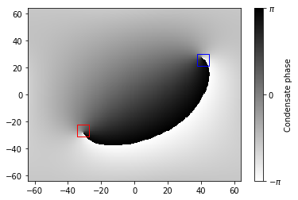

<h1 align="center">Quantum vortex tracker</h1>
<h4 align="center">Convolutional neural network for finding quantum vortices in Bose-Einstein condensates.</h4>

This project aims to build a deep learning model that can accurately predict the locations of quantum vortices
given the phase of the condensate.

## Current features
- QVT supports arbitrary grid sizes.
- Predict the positions of vortices in a dipole pair.

Below is an example of the model in action, accurately locating the vortex (blue square) and anti-vortex
(red square).

See [this notebook](vortexTracker/detect/test_model.ipynb) for more thorough tests of the model.

## How does it work?
QVT is a convolution neural network (CNN) that acts on the phase of the condensate wave function
(see [this notebook](vortexTracker/detect/model.ipynb) for details on how the model is created).
At the end of the CNN are dense layers in which the last layer outputs the two locations of the
vortices.

The model is trained on data generated using [PyGPE](https://github.com/wheelerMT/pygpe).

## Improvements
- Add support for different grid sizes.
- Add support for multiple dipoles.